# ⚡ OmniGuild (`antigravity-guild` / `omniguild`)

> **The All-In-One AI Developer Engine: Turn your AI coding assistant into a 16-person staff engineering council with BM25 probabilistic memory, AST repo-mapping, living memory bank, MetaGPT review SOPs, Repomix context packaging, local web dashboard, terminal HUD, self-healing tests, and deterministic invariants.**

[](package.json)
[-success.svg?style=flat-square)](package.json)
[](README.md)
[](LICENSE)

Run one command in any project:

```bash
npx omniguild
```
*(or `npx antigravity-guild` / `npx openguild`)*

Works out-of-the-box with **Antigravity IDE**, **Cursor**, **Claude Desktop**, **VS Code**, **Windsurf**, and **Gemini**.

---

## 😫 The Problem with AI Assistants Today

If you use Cursor, Claude, or Antigravity to write code every day, you know these frustrations:

1. **AI Amnesia:** You spend 30 minutes teaching your AI not to use `any` in TypeScript or how your auth middleware works. The next day, in a new chat, it makes the exact same mistake.
2. **Context Bloat & Sluggish Responses:** Huge system prompts burn 4,000+ tokens before you even type your prompt. Responses feel slow, cost real API dollars, and the AI suffers from *attention drift*.
3. **Shallow, Junior Code:** Most AI code works for a demo, but collapses in production: missing null checks, zero error handling, unparameterized SQL queries, and sloppy architecture.
4. **Zero Team Alignment:** Everyone on your team prompts their AI differently, resulting in mismatched styles, broken conventions, and conflicting PRs.
5. **Context Packing Blindspots:** Pasting code into chats leaks secrets, misses hidden dependencies, or exceeds context limits without clear token budgets.

### ✨ How OmniGuild Fixes This

| Without OmniGuild | With OmniGuild v3.1 |
|:---|:---|
| AI forgets project lessons every time you open a new chat | **Cross-project memory vault** remembers every architectural rule and bugfix forever |
| 4,500+ tokens burned on monolithic rules per turn | **Lean 770-token base contract** (80-85% token diet) with instant sub-second streaming |
| AI generates naive code without thinking about edge cases | **16-Mind Council** applies Google scalability, Apple UX aesthetics, and Anthropic safety |
| AI commits broken code and forgets tests | **Deterministic Verification Gate** blocks completion until tests and linters pass |
| Secrets, API keys, and raw `eval()` leak into code | **Built-in SAIF 2.0 Security Auditor** catches credentials and hazards before you commit |
| Single-shot code generation misses architectural flaws | **MetaGPT-style 4-stage Council SOP** conducts sequential Architect, Security, QA, and UX review |
| Manual copying of files causes context truncation & leaks | **Repomix-style packager** generates clean token-budgeted bundles with secret scrubbing |
| Test failures require manual debugging loops | **Autonomous Self-Healing runner** classifies errors and synthesizes surgical patches |
| Opening PRs requires manual writeups | **Council PR Architect** formats GitHub PR descriptions with Council sign-offs |

---

## ⚡ Quick Start: Zero Friction, "It Just Works"

Like an Apple product, OmniGuild eliminates configuration rituals. You don't need multiple commands, complex flags, or magic prompting rituals.

Navigate to **any project on your computer** and run **one single command**:

```bash
cd your-project
npx omniguild
```

### 🍎 What OmniGuild Does Automatically in 1 Second (99.99% Done):
1. **Links Your Global Persistent Memory Hub (`~/.openguild/memory`):** Connects past lessons, bug fixes, and architectural standards learned across all previous projects.
2. **Initializes Workspace Team Memory (`.openguild/`):** Sets up version-controlled project memory so teammates automatically share project-specific architecture decisions.
3. **Auto-Detects Universal Stack:** Identifies language (JS/TS/Python/Go/Rust/Flutter/Swift), framework, package manager, and monorepo tooling.
4. **Auto-Configures Editor MCP (Zero-Click):** Configures OmniGuild's 16 native MCP tools in Cursor, Claude Desktop, Antigravity / Gemini, VS Code, and Windsurf.
5. **Synthesizes AI Agent Rules (Zero-Prompt Mandate):** Writes `AGENTS.md`, `.cursorrules`, and `.gemini/rules.md` so the AI autonomously reviews memory, runs tests, and applies council rules without special prompting.
6. **Enforces Context Hygiene:** Updates `.gitignore` to protect API keys, credentials, and exclude AI context noise.
7. **Auto-Lints & Cleans Memory Vault:** Deduplicates and prunes redundant rules to keep your persistent memory razor-sharp.
8. **Runs SAIF 2.0 Security Audit:** Scans the codebase for committed secrets, dangerous code execution, and SQL hazards, assigning an instant letter grade (A+ to F).
9. **Profiles Context Diet & Token Savings:** Estimates active token load vs monolithic prompts, showing 80-85% token reduction and dollar savings.
10. **Installs Git Pre-Commit Hooks & Generates CI:** Automatically installs deterministic invariant pre-commit hooks and generates GitHub Actions council workflows.

---

### 💬 Just Chat Normally — Zero Prompt Burden
You **never** need to remember to tell your AI: *"Check memory"* or *"Act as the 16-mind council"*.

Even if you type a short, casual prompt:
> *"fix the checkout bug"*

Your AI assistant will **autonomously**:
1. Search your global memory for past payment/checkout lessons using BM25 ranking.
2. Review the code through Architecture, Security (SAIF 2.0), and QA lenses.
3. Fix the issue, run the project test suite, and record any new lessons so future projects never make the same mistake.

---

## 👑 The 16 Sovereign Superpowers

### 1. 🧠 Persistent Memory That Actually Learns
Never repeat yourself to an AI again. Whenever you solve a tricky bug or decide on an architectural rule, teach OmniGuild:

```bash
# Save an insight to your global memory (available across all your projects)
npx omniguild --learn "Always set Content-Type header on custom fetch calls" --category architecture

# Or teach it directly inside your chat with Cursor or Claude:
# "Remember: We always use zod to parse inbound request bodies in this project."
```

OmniGuild automatically scrubs API keys and secrets before saving, indexes the lesson with tags, and deduplicates redundant rules.

---

### 2. ⚡ Context Diet & Token Profiler (`--tokens`)
Monolithic prompts slow down your AI and cost money. OmniGuild keeps base instructions razor-thin (~770 tokens) and pulls deep knowledge only when needed via MCP tools.

Run the profiler anytime to see your token weight and savings:

```bash
npx omniguild --tokens
```

**Example Output:**
```text
# ⚡ OmniGuild Token & Context Diet Report
Efficiency Grade: A+ (🟢 Highly Optimized)
  Active Context Token Load:  771 tokens
  Standard Monolithic Prompt: 4,500 tokens
  Context Diet Savings:       83% reduction (~3,729 tokens saved/turn)
  Estimated Cost Savings:     ~$11.19 per 1,000 chat turns
```

---

### 3. 🔮 Autonomous Auto-Analyst (`--analyze`)
Have a rough idea but aren't sure how to architect it? The Auto-Analyst turns raw concepts into full production-grade blueprints in seconds:

```bash
npx omniguild --analyze "A self-hosted bookmark manager with AI auto-tagging and offline search"
```

**What it generates:**
- Inferred problem domain and target personas
- Latent edge cases and failure modes you didn't think of
- Recommended tech stack (Frontend, Backend, Database, AI models)
- Apple-grade UI/UX specifications and micro-interactions
- Security guardrails and deterministic test contracts

---

### 4. 🧪 Deterministic Verification Gate (`--verify`)
Stop trusting an AI that says *"Everything is done and working!"* when tests are failing. Run OmniGuild's unified invariant gate:

```bash
# Verify tests, linter, types, memory integrity, and git hygiene in one command
npx omniguild --verify

# Auto-fix memory duplicates and missing .gitignore rules
npx omniguild --verify --fix
```

It executes your project's native test commands (`npm test`, `pytest`, `cargo test`, `go test`) and outputs a certified invariant proof.

---

### 5. 🛡️ Deep Security & SAIF 2.0 Codebase Auditor (`--audit`)
Scan your repository for secret leaks, hardcoded credentials, and high-risk code patterns before pushing to production:

```bash
npx omniguild --audit
```

**What it catches:**
- Plaintext API keys, AWS credentials, GitHub tokens, and private keys
- Uncommitted sensitive `.env` files
- Dynamic SQL string concatenation (SQL injection hazards)
- Arbitrary code execution hazards (`eval()`)

Assigns an institutional grade (**A+ to F**) with exact filenames, line numbers, and fix instructions.

---

### 6. 👥 Git-Shared Team Memory (`--team`)
Ensure every developer on your team gets the exact same high-quality AI output:

```bash
npx omniguild --team
```

Creates a version-controlled `.openguild/` folder containing `team_memory.md` and `architecture_decisions.md`. When teammates pull the repo, their AI assistants automatically inherit all team decisions.

---

### 7. 🗺️ Token-Efficient AST Symbol Repo-Map (`--repomap`)
Reading entire source files burns thousands of tokens. OmniGuild's native AST symbol extractor indexes classes, interfaces, types, functions, and methods across JavaScript/TypeScript, Python, Go, and Rust in under 350 tokens:

```bash
# Print complete repo topology
npx omniguild --repomap

# Query-filter symbols (e.g. find all auth or database functions)
npx omniguild --repomap auth
```

Your AI assistant can also query this map dynamically during chat turns via the `openguild_get_repo_map` MCP tool to inspect project structure without wasting context.

---

### 8. 🎯 Living Memory Bank & Active Task Continuity (`--memory-bank`)
Eliminate session amnesia between chat turns. OmniGuild maintains a living task and context state engine in `.openguild/`:

```bash
npx omniguild --memory-bank
```

- **`active_task.md`**: Living record of current goals, status, constraints, next steps, and session notes.
- **`system_patterns.md`**: System architecture patterns and key invariants.
- **`decision_log.md`**: Architecture Decision Records (ADRs).

Your AI assistant automatically updates `active_task.md` via `openguild_update_active_task` so you never have to re-explain where you left off.

---

### 9. 🔍 Probabilistic BM25 Okapi Memory Search (`--search`)
Naive keyword matching fails when wording differs. OmniGuild includes a pure Node.js implementation of the **BM25 Okapi algorithm** ($k_1=1.2, b=0.75$), calculating term frequency ($TF$), inverse document frequency ($IDF$), and document length normalization:

```bash
# Probabilistic search ranked by relevance score
npx omniguild --search "JWT RS256 rotation"
```

**Example Output:**
```text
# 🔍 BM25 Hybrid Memory Search: "JWT RS256 rotation"
> Found 1 high-relevance entries across 105 vault rules.

- 🟢 [100% Match] [Workspace Team Memory] `team_memory.md:1`
  - [2026-09-04] [SECURITY] Always validate JWT signatures using asymmetric RS256 with key rotation
```

---

### 10. 🛡️ Dynamic Memory Evolution & Conflict Resolver (`--resolve-conflicts`)
When engineering practices evolve (e.g. migrating from Jest to Vitest or REST to GraphQL), stale rules cause AI hallucinations. OmniGuild automatically detects conflicting and superseded rules when lessons are recorded, or across the entire vault:

```bash
# Audit memory consistency and preview/resolve superseded rules
npx omniguild --resolve-conflicts
```

Obsolete entries are safely annotated as `[SUPERSEDED]` rather than erased, preserving historical ADRs while giving your AI crystal-clear guidance.

---

### 11. 🏛️ MetaGPT-Style Council SOP Multi-Stage Code Review (`--review`)
Single-turn code generation often introduces subtle architecture or security bugs. OmniGuild's 4-stage Standard Operating Procedure pipeline subjects code to rigorous, role-specialized review:

```bash
# Review a specific file or all project files
npx omniguild --review src/auth/jwt.js
```

**The 4 Sequential Stages:**
1. **Stage 1 (Architectural Integrity):** Evaluates modularity, dependency inversion, and separation of concerns.
2. **Stage 2 (SAIF 2.0 Security Audit):** Detects secret leakage, dynamic eval/command injection, and insecure queries.
3. **Stage 3 (Deterministic QA Invariants):** Assesses error handling, boundary validation, and test invariants.
4. **Stage 4 (Apple UX/DX Standards):** Checks API ergonomics, naming clarity, and self-documenting code quality.

Returns an institutional grade (**APPROVED**, **APPROVED_WITH_COMMENTS**, or **NEEDS_REVISION**) with actionable recommendations.

---

### 12. 📦 Repomix-Style Zero-Leak Codebase Packager (`--pack`)
When sharing code context with AI models, manual copying is tedious, error-prone, and risks leaking credentials. OmniGuild packages directory trees into clean, AI-ready Markdown documents:

```bash
# Package project with an ASCII directory tree, token estimation, and auto secret scrubbing
npx omniguild --pack

# Package a specific directory and write to a custom file
npx omniguild --pack src/ --output context_bundle.md
```

**Packager Guarantees:**
- **Zero Secret Exposure:** Automatically strips API keys, OAuth tokens, and `.env` credentials before bundling.
- **Noise Exclusions:** Excludes `.git`, `node_modules`, `dist`, binary files, and lockfiles.
- **Token Profiling:** Computes exact file counts, character counts, and estimated token usage.

---

### 13. 🖥️ Interactive Apple-Grade Terminal HUD (`--ui` / `-u`)
When you want a visual interactive cockpit in your terminal without typing flags:

```bash
npx omniguild --ui
```

Features responsive arrow/number navigation, instant type-to-search across memory vaults, AST symbol browsing, and 1-click execution of Council reviews and context packaging.

---

### 14. 🌐 Zero-Dependency Local Web Visualizer Dashboard (`--dashboard`)
Launch an instant, offline-capable dark mode browser interface on `http://localhost:4321`:

```bash
npx omniguild --dashboard
```

- **Interactive 16-Mind Council Chamber:** Review council domains and simulate multi-agent debates.
- **Live BM25 Memory Search:** Interactive search bar with real-time confidence scores.
- **AST Repo-Map Viewer:** Browse project symbols and file hierarchies visually.
- **Token Diet & Cost Calculator:** Calculate exact dollar and token savings.

---

### 15. 🧬 Autonomous Self-Healing Test Runner & Diagnoser (`--heal`)
Stop guessing why tests failed:

```bash
npx omniguild --heal
```

Captures runtime failures, classifies root-cause error types (Assertion Mismatches, Syntax Errors, Missing Modules, Null Pointer Exceptions), extracts exact files and lines, suggests minimal surgical patches, and auto-records lessons into memory.

---

### 16. 📝 Council PR & Commit Architect (`--pr` / `--commit`)
Streamline pull requests and commit hygiene with institutional Council sign-offs:

```bash
# Generate executive GitHub PR description from git diff
npx omniguild --pr

# Synthesize standardized conventional commit message
npx omniguild --commit "Add user authentication middleware"
```

Generates GitHub Flavored Markdown containing Impacted Files, Multi-Role Council sign-offs (Architecture, SAIF Security, QA Invariants), test proofs, and conventional commits.

---

## 💡 The Prompt Playbook (Copy & Paste Into Your Chat)

Once OmniGuild is set up, you don't need complex prompting. Copy and paste these **battle-tested prompts** into Cursor, Claude, or Antigravity:

### 🚀 1. Before Starting a New Feature (System Design)
> *"Act as the Chief Software Architect and 16-Mind Council. Review this feature request: [Describe Feature]. Design the data model, API contracts, edge cases, and component boundaries before writing any code."*

### 🎨 2. Polishing UI & User Experience (Apple Standard)
> *"Review this screen through the lens of the Apple CTO and UI/UX Lead. Make typography, responsive layout, spacing, accessible contrast, and micro-interactions feel clean, premium, and intuitive."*

### ⚡ 3. Optimizing Slow Code or Database Queries
> *"Have the Performance Specialist and Database Reliability Engineer review our queries, caching, and state management. Identify any N+1 query patterns, memory leaks, or unindexed lookups."*

### 🛡️ 4. Security & Bug Audit (Before Submitting PR)
> *"Act as the Chief Security Officer and QA Lead. Audit this code for unhandled null/undefined values, secret leakage, unparameterized queries, and race conditions."*

### 🧪 5. Deterministic Verification Gate
> *"Run our automated test suite and typechecks using the openguild_verify_invariants tool. Do not mark this task as complete until all tests pass deterministically."*

---

## 🏛️ The 16-Mind Supreme Council

OmniGuild models its engineering guidelines after 16 specialized roles. Each mind focuses on a critical pillar of production software:

```mermaid
graph TD
    User([Developer / User]) --> OmniGuild[OmniGuild Unified Brain]
    OmniGuild --> Core[Core Engineering]
    OmniGuild --> BigTech[Big Tech CTO Minds]
    OmniGuild --> Specialists[Deep Domain Specialists]
    OmniGuild --> AGI[Autonomous & AGI Systems]

    Core --> Arch["🧠 Chief Software Architect"]
    Core --> UI["🎨 Principal UI/UX Lead"]
    Core --> Sec["🛡️ Chief Security Officer"]
    Core --> Eng["⚡ Staff Full-Stack Engineer"]
    Core --> QA["🧪 Principal QA Lead"]
    Core --> DevOps["🚀 DevOps Engineer"]

    BigTech --> Google["🌐 Google CTO Brain (Scalability)"]
    BigTech --> Apple["🍎 Apple CTO Brain (Aesthetics)"]
    BigTech --> Anthropic["🧭 Anthropic Safety Brain (Alignment)"]

    Specialists --> Perf["⚡ Performance Specialist (O(n), Caching)"]
    Specialists --> DB["🗄️ Database Reliability Engineer (ACID)"]
    Specialists --> Prod["💼 Product Strategy Lead (Anti-Bloat)"]

    AGI --> Cog["🔮 Chief Cognitive Analyst (Latent Edge Cases)"]
    AGI --> Sci["🔬 Principal AGI Scientist (Cognitive Loops)"]
    AGI --> Heal["🧬 Self-Healing Specialist (Fault Recovery)"]
    AGI --> Graph["📊 Knowledge Graph Architect (Vector & RAG)"]
```



---

## 🌐 Model Context Protocol (MCP) Server

OmniGuild Sovereign exposes **16 native MCP tools** — 1 dedicated superpower for each of the 16 Council Minds:

| MCP Tool | Council Mind | What It Does for the AI |
|:---|:---|:---|
| `openguild_search_memory` | 📊 Knowledge Graph Architect | Probabilistic BM25 Okapi search ranking the most relevant architectural rules & lessons |
| `openguild_resolve_memory_conflicts` | 🧬 Self-Healing Specialist | Audits memory vaults and auto-annotates superseded rules to eliminate hallucinations |
| `openguild_get_repo_map` | 🧠 Chief Software Architect | Extracts a token-dense AST symbol topology across JS/TS, Python, Go, and Rust |
| `openguild_read_memory_bank` | 💼 Product Strategy Lead | Reads living active task context, system architecture patterns, and decision logs |
| `openguild_update_active_task` | 💼 Product Strategy Lead | Autonomously updates active task progress, constraints, and next steps in `.openguild/active_task.md` |
| `openguild_auto_analyze` | 🔮 Chief Cognitive Analyst | Auto-analyzes product visions and codebases to generate complete engineering blueprints |
| `openguild_profile_tokens` | ⚡ Performance Specialist | Checks AI rule token weight, efficiency scores, and context savings |
| `openguild_verify_invariants` | 🧪 Principal QA Lead | Runs hermetic verification across tests, linters, types, memory, and git hygiene |
| `openguild_audit_security` | 🛡️ Chief Security Officer | Scans files for exposed API credentials, SQL injection, and code hazards |
| `openguild_council_sop_review` | 🔬 Principal AGI Scientist | Executes a MetaGPT-style 4-stage sequential code review (Architect, Security, QA, UX) |
| `openguild_pack_context` | 🚀 DevOps Engineer | Repomix-style packager bundling codebase files into clean, token-budgeted Markdown |
| `openguild_read_memory` | 🌐 Google CTO Brain | Retrieves architectural rules, user preferences, and past bugfixes |
| `openguild_write_memory` | 🗄️ Database Reliability Engineer | Saves new engineering standards or decisions directly from the chat session |
| `openguild_learn` | 🧭 Anthropic Safety Brain | Self-reflects on errors, records lessons, and automatically scrubs secrets |
| `openguild_consult_council` | 🍎 Apple CTO Brain | Queries the 16-Mind Council in `debate`, `audit`, or `consensus` mode |
| `openguild_get_project_context` | ⚡ Staff Full-Stack Engineer | Inspects detected tech stack, test commands, and invariant rules |

---

## ⚙️ Complete CLI Cheat Sheet

| Command / Flag | Purpose | Example |
|:---|:---|:---|
| `npx omniguild` | Initialize or update OmniGuild in current project | `npx omniguild` |
| `npx omniguild -u, --ui` | Launch interactive Apple-grade terminal HUD dashboard | `npx omniguild --ui` |
| `npx omniguild --dashboard` | Launch local zero-dependency web visualizer dashboard | `npx omniguild --dashboard` |
| `npx omniguild --heal` | Run autonomous self-healing test runner and error diagnosis | `npx omniguild --heal` |
| `npx omniguild --pr` | Generate executive Council PR description from git diff | `npx omniguild --pr` |
| `npx omniguild --commit [msg]` | Synthesize standardized conventional commit with Council sign-off | `npx omniguild --commit "Fix auth bug"` |
| `npx omniguild --search <query>` | BM25 probabilistic search across all memory vaults | `npx omniguild --search "auth token"` |
| `npx omniguild --resolve-conflicts` | Audit memory vaults and resolve superseded/conflicting rules | `npx omniguild --resolve-conflicts` |
| `npx omniguild --repomap [query]` | Print token-dense AST symbol topology across project | `npx omniguild --repomap auth` |
| `npx omniguild --memory-bank` | Inspect living active task context and patterns | `npx omniguild --memory-bank` |
| `npx omniguild --review [file]` | Run MetaGPT-style 4-stage Council SOP code review | `npx omniguild --review lib/auth.js` |
| `npx omniguild --pack [path]` | Repomix-style codebase packager with secret scrubbing | `npx omniguild --pack src/` |
| `npx omniguild --preset <name>` | Use a targeted preset (`full`, `agi`, `backend`, `web`, `mobile`, `ai-ml`) | `npx omniguild --preset backend` |
| `npx omniguild --setup-mcp [editor]` | 1-Click configure MCP for `cursor`, `claude`, `antigravity`, or `all` | `npx omniguild --setup-mcp all` |
| `npx omniguild --tokens` | Benchmark context token consumption and cost savings | `npx omniguild --tokens` |
| `npx omniguild --verify [--fix]` | Run unified tests, lint, typecheck, and memory check | `npx omniguild --verify --fix` |
| `npx omniguild --audit` | Scan project for secret leaks and code vulnerabilities | `npx omniguild --audit` |
| `npx omniguild --analyze "<idea>"` | Auto-generate comprehensive architecture blueprint | `npx omniguild --analyze "Real-time sync engine"` |
| `npx omniguild --learn "<insight>"` | Record an engineering lesson with secret scrubbing | `npx omniguild --learn "Use redis locks for queue jobs"` |
| `npx omniguild --team` | Initialize Git-shared team memory in `.openguild/` | `npx omniguild --team` |
| `npx omniguild --setup-ci` | Generate GitHub Actions Council Review workflow | `npx omniguild --setup-ci` |
| `npx omniguild --lint-memory [--fix]` | Clean duplicate rules and format memory vault | `npx omniguild --lint-memory --fix` |
| `npx omniguild --status` | Inspect active memory files, council status, and stats | `npx omniguild --status` |
| `npx omniguild --export-memory` | Backup memory vault to JSON file | `npx omniguild --export-memory backup.json` |
| `npx omniguild --import-memory <file>`| Restore or merge memory vault from JSON backup | `npx omniguild --import-memory backup.json` |
| `npx omniguild --install-hooks` | Install Git pre-commit invariant verification hook | `npx omniguild --install-hooks` |
| `npx omniguild --dry-run` | Preview actions without modifying disk | `npx omniguild --dry-run` |

---

## 🔒 Privacy, Security & Zero-Dependency Guarantee

- **100% Pure Node.js Built-ins:** Requires zero npm dependencies. No bloated node_modules trees, no supply chain vulnerabilities.
- **Runs Exclusively on Your Machine:** Never sends your code, prompts, memory, or metadata to external servers or third-party cloud APIs.
- **Automated Secret Scrubbing:** Automatically detects and strips API keys, OAuth tokens, and private keys before anything touches memory or context packages.
- **Safe, Non-Destructive Merging:** Never blindly overwrites existing `.cursorrules` or configuration files; intelligently merges rules while preserving your custom instructions.

---

## ❓ Frequently Asked Questions (FAQ)

### Does OmniGuild slow down my editor or chat?
**No, it speeds it up.** Traditional prompt templates dump thousands of lines into the base context, causing slow responses and attention drift. OmniGuild uses an ultra-lean base contract (~770 tokens) and lets the AI query deeper memory via lightweight MCP tools only when needed.

### Where is my global memory stored?
Global memory lives in `~/.openguild/memory/` on your machine (`C:\Users\<User>\.openguild\memory` on Windows). It is organized into clean markdown files (`institutional_memory.md`, `security_standards.md`, `user_profile.md`) that you can inspect and edit anytime.

### How do I share memory with my teammates?
Run `npx omniguild --team`. This creates a `.openguild/` folder inside your repository. Commit this folder to Git. Any teammate who pulls the repository will automatically share project architecture decisions and team standards.

### Can I use OmniGuild with existing projects?
**Yes.** OmniGuild was designed specifically for existing, mature codebases. It automatically detects your package manager, test scripts, and directory layout without breaking existing workflows.

---

## 📄 License

MIT © [Hardik Patel](https://github.com/imHBpatel)